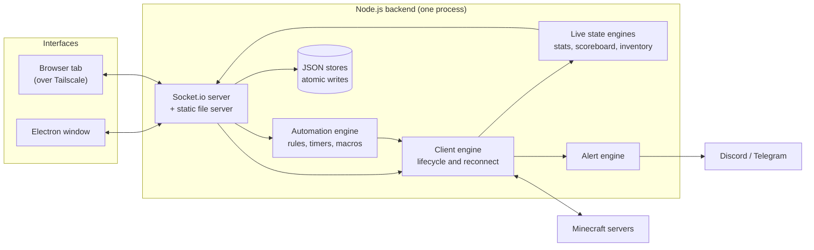

# Minecraft Client Manager (overview)

A desktop and self-hosted app for running, automating and monitoring many headless Minecraft clients from one dashboard. I built it for my own use, and it now runs 24/7 on my home server.

> **Source code is private.** This repository is a project overview: what the app does, how it is built and the decisions behind it.

**Stack:** Node.js · Electron · Socket.io · Mineflayer · vanilla JavaScript frontend · systemd · Caddy · Tailscale
**Status:** work in progress, pre-1.0. Latest release `v0.15.6`: 27 releases and 134 commits between May and August 2026, tracked in a changelog.

---

## What it does

- **Manage many clients from one place.** Group them into folders, reorder with drag and drop, and connect or disconnect a whole folder at once. Each client has its own server address, game version (or auto-detect) and account type.
- **Stay online without supervision.** Dropped connections retry with increasing delays (10 s, 20 s … up to once a minute) and never give up, so an overnight outage or server restart doesn't leave a client offline.
- **Automate with rules, timers and macros.** Rules fire commands when a chat message matches or the client spawns. Timers send commands on an interval. Macros chain commands with delays, and rules and timers can trigger macros.
- **Watch everything live.** A side panel shows each client's health, position, ping, connection uptime and disconnect history, plus the server's scoreboard, the inventory and a filterable chat log with server colors.
- **Get alerted when nobody is watching.** If a client stays down past a threshold, the app sends a Discord or Telegram message, and another one when it recovers. Short blips stay silent.

## Architecture

The backend runs inside the Electron main process on a desktop, or on its own (`npm run start:server`) on a server. In both cases it serves the frontend from the same port, so the browser and the Electron window use the same code.

## Design decisions

- **Push only what is watched.** Live stats and inventory data are produced only for the client the interface is looking at, and only sent when something changes. This keeps the socket traffic small with many clients running.
- **Two clocks, not one.** "Connection is up" and "client is in the game" are tracked separately, because a server can move a client between worlds without dropping the connection.
- **Cancel stale work on disconnect.** Pending macro steps and intervals are cleared when a client drops, so they don't leak into the next session after reconnecting.
- **Never lose the data file.** Settings and client lists are written atomically. A corrupted file is backed up and the app still starts.
- **One source for the version number.** The version lives only in `package.json`. Releases are tagged on `main` after merge and documented in a changelog.

## Security

- The backend listens on `127.0.0.1` by default. On the server it binds only to the Tailscale interface, so the panel is reachable over a private network, never the public internet.
- Socket handshakes pass an origin check, so a random website can't connect to the local backend through the browser.
- Passwords and alert tokens are never sent to the interface (they show as `******`) and are stored separately from the client list.
- User-controlled text is rendered with `textContent`, not as HTML.

**Known limitation:** the app has no user authentication yet. That's why it is only exposed on localhost or a private network.

## Status and what's next

The app is still in the `0.x` stage, so features and behavior can change between releases, and there are bugs left to find. The latest releases fixed issues found in two review rounds, including two bugs where a single request could crash every running client.

Next on the list:

- User authentication for the web panel
- More stability work and tests before a first stable `1.0` release

## Deployment

On my home server the backend runs as a **systemd** service. Data lives outside the code directory, so `git pull` never overwrites it. **Caddy** adds TLS when needed, and **Tailscale** connects my devices to the panel. The desktop app is packaged with electron-builder for Windows (installer/portable) and Linux (AppImage/.deb).

---

*Personal project by [Orkun Karaca](https://github.com/orknkrc).*
